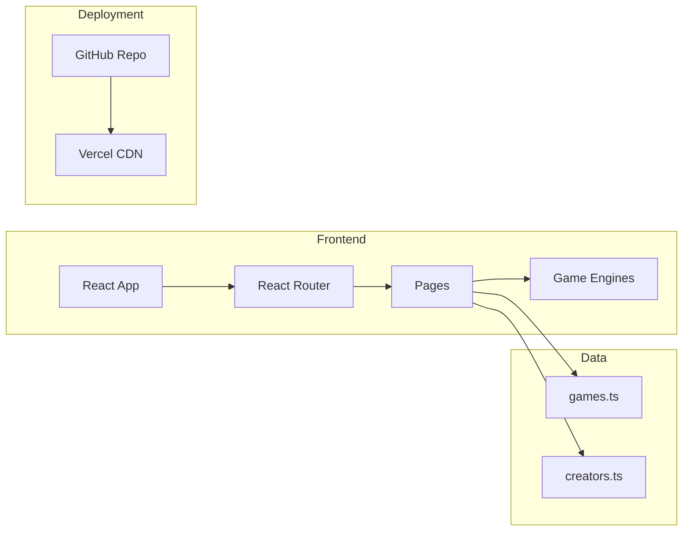
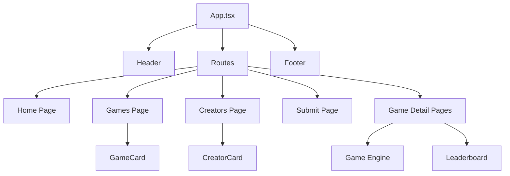

# Game Hub

## Motivation

Game Hub is an arcade gaming platform where kids aged 7-15 can submit game ideas and see them brought to life through AI-powered development. The platform showcases games created by young developers, making coding fun and accessible. By combining retro arcade aesthetics with modern web technologies, we inspire the next generation of game developers while providing a safe, educational environment for creative expression.

## Architecture

### System Architecture



### Component Hierarchy



## Tech Stack

- **Frontend:** React 19 + TypeScript - Modern UI with type safety
- **Routing:** React Router v6 - Client-side navigation
- **Styling:** Tailwind CSS - Utility-first styling with custom design tokens
- **Build Tool:** Vite - Fast development and optimized production builds
- **Game Rendering:** Canvas API - High-performance 2D game graphics
- **Deployment:** Vercel - Automatic deployments with CDN distribution
- **Version Control:** Git + GitHub - Source control and CI/CD integration

### Why These Technologies?

- **React:** Component-based architecture for reusable UI elements
- **TypeScript:** Catch errors early, better IDE support, self-documenting code
- **Vite:** Lightning-fast HMR, optimized builds, modern ESM support
- **Tailwind:** Consistent design system, responsive utilities, minimal CSS
- **Canvas:** Native browser API for smooth 60fps game rendering
- **Vercel:** Zero-config deployment, automatic HTTPS, global CDN

## Project Structure

```
game_center/
├── src/
│   ├── components/
│   │   ├── layout/          # Header, Footer - shared across all pages
│   │   ├── game/            # GameCard, Leaderboard - game-related UI
│   │   ├── creator/         # CreatorCard - creator profile cards
│   │   └── ui/              # Reusable UI components
│   ├── pages/
│   │   ├── Home.tsx         # Landing page with hero section
│   │   ├── Games.tsx        # Game gallery with creator carousels
│   │   ├── Creators.tsx     # Meet the crew page
│   │   ├── SubmitGame.tsx   # Game submission form
│   │   └── games/           # Individual game pages
│   │       └── Pong.tsx     # Pong game with leaderboard
│   ├── games/               # Game engine implementations
│   │   └── pong/
│   │       └── PongEngine.tsx  # Canvas-based Pong logic
│   ├── data/
│   │   ├── games.ts         # Game metadata and descriptions
│   │   └── creators.ts      # Creator profiles and Game Master info
│   ├── types/
│   │   └── index.ts         # TypeScript type definitions
│   └── styles/
│       └── design-system.ts # Design tokens and theme configuration
├── docs/
│   ├── STYLE_GUIDE.md       # Design system reference
│   ├── GAME_TEMPLATE.md     # Game development guide
│   └── TESTING.md           # QA standards and checklists
├── templates/
│   └── game-template/       # Boilerplate for new games
├── AGENTS.md                # AI agent development guide
├── README.md                # This file
├── package.json             # Dependencies and scripts
├── tsconfig.json            # TypeScript configuration
├── tailwind.config.js       # Tailwind customization
└── vite.config.ts           # Vite build configuration
```

## Deployment

### Hosting
Hosted on **Vercel** with automatic deployments from the `main` branch.

### Deployment Process
1. Push changes to `main` branch on GitHub
2. Vercel automatically detects changes
3. Runs build process (`npm run build`)
4. Deploys to global CDN
5. Site is live at production URL

### Environment
- **Node Version:** 18.x
- **Build Command:** `npm run build`
- **Output Directory:** `dist`
- **Framework:** Vite

### Local Development
```bash
# Install dependencies
npm install

# Start development server
npm run dev

# Build for production
npm run build

# Preview production build
npm run preview
```

Visit `http://localhost:5173` for local development.

## For Developers

### AI Agents
See [AGENTS.md](AGENTS.md) for comprehensive development guide including:
- Development principles (readable, modular, reusable, consistent)
- Design consistency rules
- Workflow for new features
- Testing requirements

### Adding Games
See [docs/GAME_TEMPLATE.md](docs/GAME_TEMPLATE.md) for complete game development workflow including:
- Template usage
- Pygame to Canvas conversion
- Game-specific testing
- Integration steps

### Design System
See [docs/STYLE_GUIDE.md](docs/STYLE_GUIDE.md) for:
- Color palette
- Typography system
- Component patterns
- Spacing and layout rules

### Testing
See [docs/TESTING.md](docs/TESTING.md) for:
- Pre-commit checklist
- Component testing
- Game-specific testing
- Visual regression checks

## Quick Links

- **Live Site:** [Deployed on Vercel]
- **GitHub Repository:** [Source Code]
- **Submit a Game:** Use the "Submit Game" page on the site
- **Report Issues:** GitHub Issues
- **Style Guide:** [docs/STYLE_GUIDE.md](docs/STYLE_GUIDE.md)
- **Agent Guide:** [AGENTS.md](AGENTS.md)

## Features

### Current Games
- **Pong:** Classic arcade game with AI opponent, leaderboard, and player name tracking

### Pages
- **Home:** Hero section with call-to-action
- **Games:** Gallery with creator-specific carousels
- **Creators:** Meet the young developers and Game Master
- **Submit Game:** Form to submit new game ideas

### Design Features
- Retro arcade aesthetic with neon glow effects
- Responsive design (mobile, tablet, desktop)
- Smooth animations and transitions
- Consistent 350px hero sections across all pages
- Uniform navigation with arcade-themed colors

## Contributing

### For Game Creators (Kids)
1. Visit the "Submit Game" page
2. Fill out the form with your game idea
3. We'll help bring it to life using AI
4. Your name will be featured as the creator

### For Developers (AI Agents)
1. Read [AGENTS.md](AGENTS.md) thoroughly
2. Follow existing code patterns
3. Check [docs/STYLE_GUIDE.md](docs/STYLE_GUIDE.md) for design rules
4. Run through [docs/TESTING.md](docs/TESTING.md) checklist
5. Submit changes for review

## Support

Help keep the arcade running! Support us through the site.

---

**Built with ❤️ to inspire young game developers**
